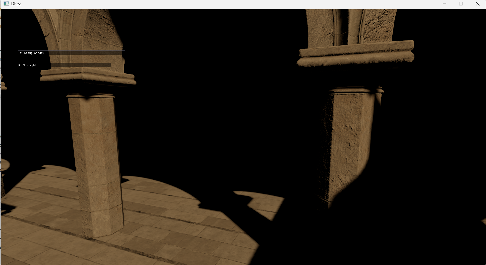
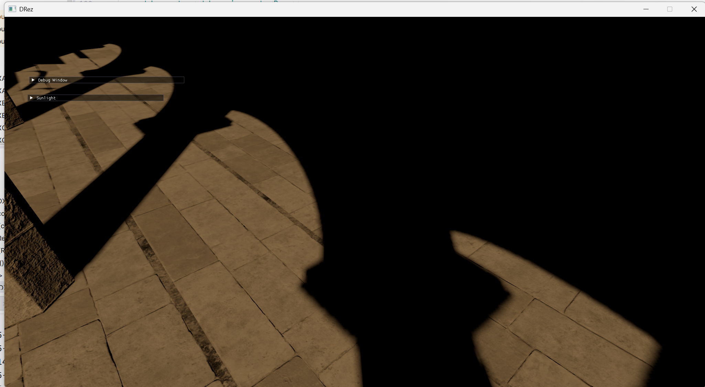
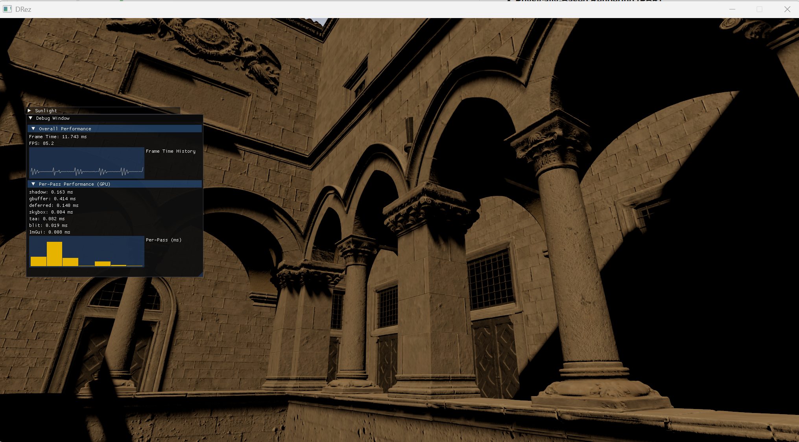

# DRez
DRez is a modern rendering engine built with **DirectX 12**, serving as a complete rewrite of [VRez](https://github.com/KoS-Y1/VRez) with a stronger focus on performance, modularity, and modern graphics techniques.

---
## Features
### Rendering
+ **Deferred Rendering Pipeline** 
  + G-Buffer Pass
  + Lighting Pass
+ **Physically-Based Rendering (PBR)**
  + Directional Light
+ **Image-Based Lighting (IBL)**
+ **Shadow Mapping**
  + Directional Light
+ **Skybox Rendering**
+ **Temporal Anti-Aliasing (TAA)**
+ **Tonemapping**
  + HDR to LDR Conversion
+ **Compute Shader Mipmap Generation**

### Shader System
+ Runtime **SLANG** Compilation
+ Automatic Extraction of **Descriptors**
+ Support for **Static Samplers**
+ **Bindless Descriptors** Architecture
+ **Vertex Pulling**

### Assets
+ Static **GLTF** Models Loading
+ Hierarchical **Scene Nodes** Framework

## Screenshots

## Reference
+ [DirectX-Graphics-Samples](https://github.com/microsoft/DirectX-Graphics-Samples)
+ [Direct3D 12 graphics](https://learn.microsoft.com/en-us/windows/win32/direct3d12/direct3d-12-graphics)
+ [Bindless Rendering in DirectX12 and SM6.6](https://rtarun9.github.io/blogs/bindless_rendering/)
+ [Temporal Antialiasing Starter Pack](https://alextardif.com/TAA.html)
+ [Temporal AA and the Quest for the Holy Trail](https://www.elopezr.com/temporal-aa-and-the-quest-for-the-holy-trail/)
